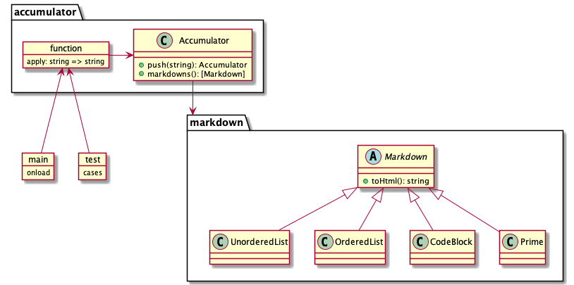

# slack markdown
chrome extension for convert editing markdown to html, for slack.

## run and specs
edit markdown.


input `cmd + Space` before submit. will be converted.


submit and preview.


## for dev
### init
```
npm install --save-dev webpack webpack-cli copy-webpack-plugin

npm install --save-dev typescript ts-loader

npm install --save-dev @types/chrome
```

### build
```
npx webpack --mode production
```

### deploy
load `dist/` on chrome

### classes
summary for classes.



### test
run [test.ts](./src/test.ts)

